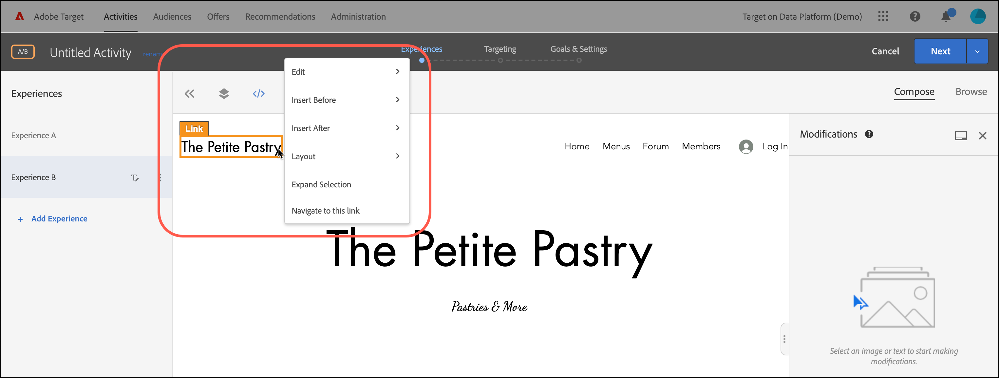
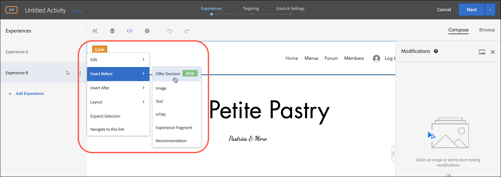

# Use offer decisions

Use [!DNL Adobe Target] with [!DNL Adobe Journey Optimizer] offer decisions to determine and deliver the next best offer for your visitors on web and mobile.

Add offer decisions created in [!DNL Adobe Journey Optimizer] to [!DNL Target] activities (manual [!UICONTROL A/B Test] or [!UICONTROL Experience Targeting]) using either the [!UICONTROL Visual Experience Composer] (VEC) or the [!UICONTROL Form-Based Composer] to test and deliver personalized offers to your visitors on your inbound channels powered by [!DNL Target].

For more information about [!DNL Adobe Journey Optimizer], see [Get Started with Journey Optimizer](https://experienceleague-review.corp.adobe.com/docs/journey-optimizer/using/get-started/get-started.html) in the *Journey Optimizer* documentation.

For more information, see [About Decision Management](https://experienceleague.adobe.com/docs/journey-optimizer/using/offer-decisioniong/get-started/starting-offer-decisioning.html) in the *[!DNL Journey Optimizer] documentation*.

## Prerequisites 

To use offer decisions in [!DNL Target], you need the following:

* [!DNL Adobe Target Standard] or [!DNL Adobe Target Premium] implemented using the [Adobe Experience Platform Web SDK](/help/c-implementing-target/c-implementing-target-for-client-side-web/aep-web-sdk.md).

  The feature is not available when implementing [!DNL Target] with at.js or other [!DNL Target] SDKs.

* [!DNL Adobe Journey Optimizer Ultimate] (AJ0 + Offer Decisioning) or [!DNL Adobe Experience Platform] and the [!UICONTROL Offer Decisioning] application service add-on.

## Use cases

The following examples are use cases of how you can use the [!DNL Target]/[!DNL Adobe Journey Optimizer] integration to use offer decisions in [!DNL Target] activities:

### Sports merchandising

As a marketer for a sporting league, you want to personalize content on your homepage (on both desktop and mobile website). You want to personalize content based on the visitor's favorite team and recent player moves to present them an offer to shop related franchise merchandise. For example, to deliver a personalized experience for each of the following regions: Dortmund, Frankfurt, and Bochum and for users that are implicit and explicit fans of these teams. As metrics, you want to look at visits and clicks to the merchandise site.

You want to design an A/B Test activity (50/50 split) between the default experience and the personalized experience (which includes an offer decision with offers for each region and team). You want to use this activity to determine the conversion and the lift for the personalized experience versus control.

### Game streaming platform

As a marketer for a sporting organization, you want to deliver a personalized offer for a game streaming platform for desktop and mobile users from different geographies: Germany, France, Mexico, and Brazil. When a visitor accesses the desktop or mobile website from one of those geographies, you want to deliver an offer for game streaming in the local language and with a corresponding price for the local currency.

In [!DNL Adobe Journey Optimizer], you can create a personalized homepage hero offer for each of the geographies targeted plus a fallback offer with a default homepage hero. You can then create an offer decision that incorporates the these offers and their eligibility rules. Then, in [!DNL Target], you can create an [!DNL Experience Targeting] (XT) activity and insert that offer decision in your desktop or mobile website to deliver the personalized experience to visitors.

## Create an experience that uses offer decisions:

1. While editing or creating a manual [!UICONTROL A/B Test] or [!UICONTROL Experience Targeting] (XT) activity in the [!UICONTROL Visual Experience Composer] (VEC), click a page element to display the [options menu](/help/c-experiences/c-visual-experience-composer/viztarget-options.md).

   

   >[!NOTE]
   >
   >You can also create an experience that uses [!UICONTROL Offer Decisions] in the [[!UICONTROL Form-Based Experience Composer]](/help/c-experiences/form-experience-composer.md).

1. Click **[!UICONTROL Insert Before]**, **[!UICONTROL Insert After]**, or **[!UICONTROL Replace Content]**, then click **[!UICONTROL Offer Decision]**.

   The [!UICONTROL Offer Decision] option is available when editing or creating [manual [!UICONTROL A/B Test]](/help/c-activities/t-test-ab/test-ab.md#types) or [[!UICONTROL Experience Targeting]](/help/c-activities/t-experience-target/experience-target.md) (XT) activities only. This option is not available for other activity types. The available options in the menu vary depending on the selected element.

   

1. In the **[!UICONTROL Add Offer Decision]** dialog box, select the desired placement.

   A [placement](https://experienceleague.adobe.com/docs/journey-optimizer/using/offer-decisioniong/create-components/creating-placements.html){target=_blank} in [!DNL Adobe Journey Optimizer] helps ensure that the right offer content displays in the right location.

   

1. Select the desired offer decision, then click **[!UICONTROL Create]**.

   

   Your web site displays in the VEC where you can see the newly created offer decision in the [!UICONTROL Modifications] pane on the right side. You can hover over the modification and click the [!UICONTROL Preview] icon to examine the offer decision.

   

   You can examine the various offers contained in the offer by clicking the appropriate icon at the bottom of the [!UICONTROL Offer Preview] dialog box, including the fallback offer. A fallback offer is the default offer displayed when a visitor is not eligible for any of the personalized offers in the collection.

   

1. Finish creating the activity by completing the [!UICONTROL Targeting] and [!UICONTROL Goals & Settings] steps of the three-part guided workflow.

   >[!IMPORTANT]
   >
   >To ensure that the [!DNL Target] activity is personalized, make sure the current activity start/end dates are in sync with the offer decision's start/end dates in [!DNL Adobe Journey Optimizer]. If the [!DNL Target] start/end dates are outside the offer decision's start/end date range, the default [!DNL Target] content displays to visitors.

   

## Notes and limitations

Consider the following notes and limitations as you work with offer decisions:

* The offer decisioning integration works for [!DNL Target] implementations based on the [Adobe Experience Platform Web SDK](/help/c-implementing-target/c-implementing-target-for-client-side-web/aep-web-sdk.md).

  The feature is not available when implementing [!DNL Target] with at.js or other [!DNL Target] SDKs.

* The Target/Adobe Journey Optimizer integration supports [manual [!UICONTROL A/B Test]](/help/c-activities/t-test-ab/test-ab.md#types) and [[!UICONTROL Experience Targeting]](/help/c-activities/t-experience-target/experience-target.md) (XT) activities only. This feature is not available for other activity types.

* Offers with the text/html content type do not support deliveryURL content delivery. The deliveryURL is only supportable through the Form-Based Experience Composer where the client is responsible for explicitly fetching and composing the content.

* [!DNL Target] reporting does not provide offer-decision level reporting.

* Visualizing [QA links](/help/c-activities/c-activity-qa/activity-qa.md) for [!DNL Target] experiences that contain offer decisions affects frequency capping set in [!DNL Adobe Journey Optimizer] for those offer decisions.

