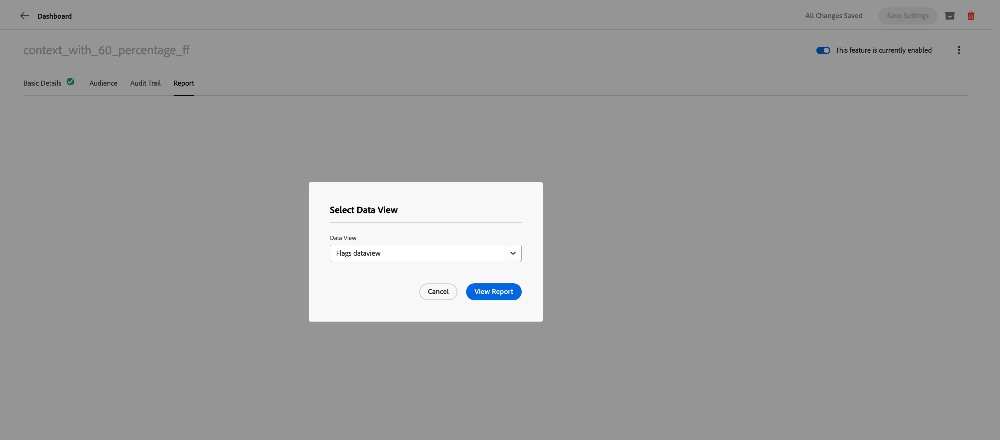
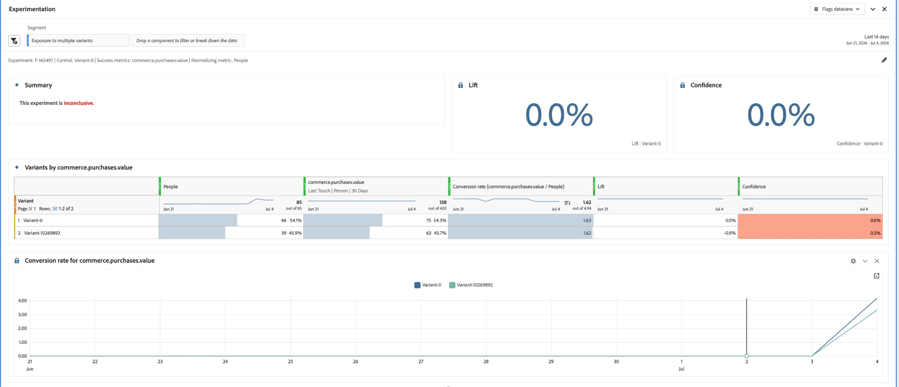

# Reporting {#reporting}

Flags delivers reporting through **Customer Journey Analytics (CJA)**. A **Report** tab is available on every feature flag and feature group detail page. It lets you view a CJA report scoped to that specific flag or group, embedded directly in the page.

>[!NOTE]
>
>Reports open with a **30-day** reporting window by default. You can adjust the range from the panel header.

## Prerequisites {#prerequisites}

Before you can view reports, ensure that:

1. Reporting is set up for your application — see [Set up CJA for feature flags reporting](set-up-cja-reporting.md).
1. Your feature flag or feature group is active and has accumulated data.

## View a report {#view-report}

### Open the Report tab and pick a data view {#open-report-tab}

1. Open a feature flag or feature group and select the **Report** tab.
1. A **Select Data View** dialog opens, listing the CJA data views available to you. The first one is selected by default.
1. Choose the data view you want and select **View Report**. Select **Cancel** to close the dialog without loading a report.
1. The report loads inside the tab, scoped to that flag or group's entity ID.

>[!NOTE]
>
>The dialog lists only the data views you have access to in the current sandbox. If none are available, the dialog shows a message and **View Report** stays disabled — check your data view permissions or switch sandbox.

### View the performance report {#view-performance-report}

The embedded **Flags Overview** dashboard displays:

* **Total People**, **People Participation by day**, and **People Participation by Variant** (control group vs. variant IDs)
* An **Overview** table listing each variant with its people count and participation percentage

Adjust the date range from the panel header to re-plot for a different window (default 30 days).

### Explore experimentation results {#explore-experimentation-results}

1. In the **Experimentation** panel, the **Experiment** (flag or group entity ID) and **Control variant** are pre-selected.
1. Add a **Success metric** using **Add metric**, and choose a **Normalizing metric** (default **People**) based on which graph you want plotted.
1. Optionally enable **Include confidence upper/lower bounds**.
1. Select **Build** to compute **Lift**, **Confidence**, and **Conversion rate** per variant for the selected metric.

See the [Experimentation panel documentation](https://experienceleague.adobe.com/en/docs/analytics-platform/using/cja-workspace/panels/experimentation) for more details on how these metrics are calculated.

## See also {#see-also}

* [Set up CJA for feature flags reporting](set-up-cja-reporting.md)
* [Create your first feature flag](create-your-first-feature-flag.md)
* [A/B testing with feature flags](a-b-testing.md)
* [Create a feature group](create-a-feature-group.md)

<!-- -->
