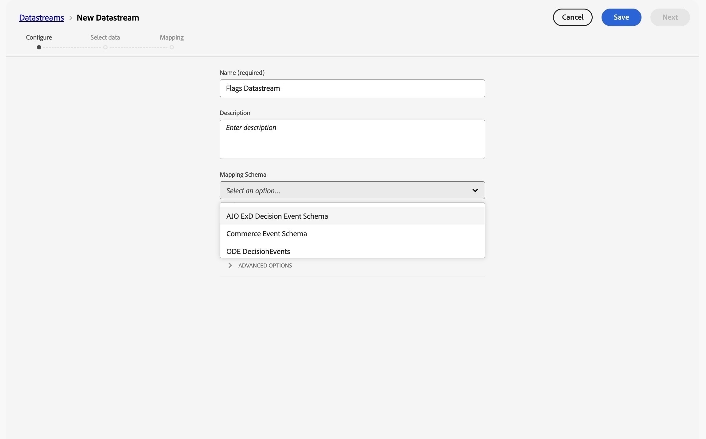
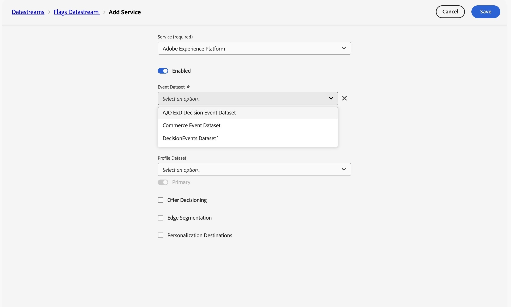
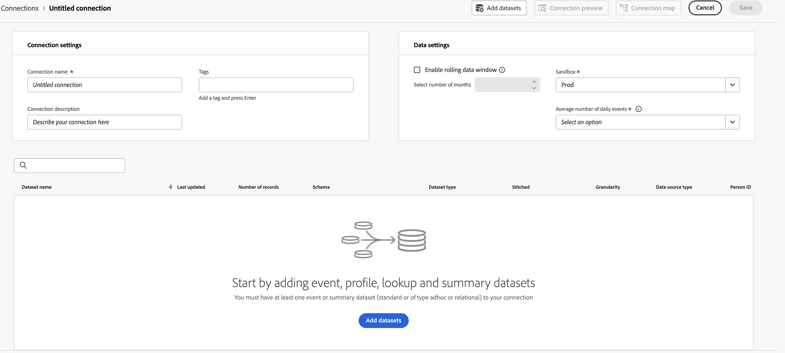
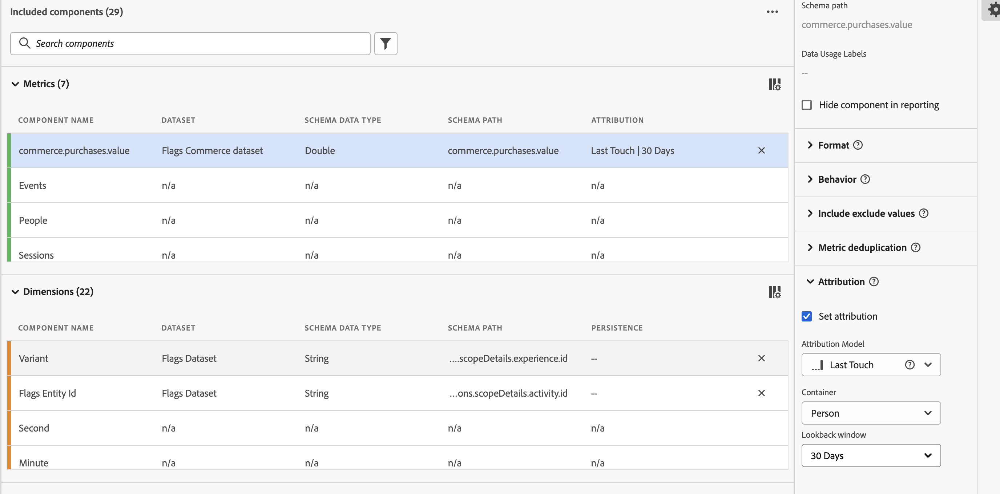

# Set up CJA for feature flags reporting {#set-up-cja-reporting}

The integration between Flags and Adobe Customer Journey Analytics (CJA) provides a unified way to measure the business impact of feature flag variants. Apply CJA success metrics to Flags reports at any time and take advantage of Customer Journey Analytics features, such as the [Experimentation panel](https://experienceleague.adobe.com/en/docs/analytics-platform/using/cja-workspace/panels/experimentation), to evaluate experiment performance and understand how feature variants influence customer behavior.

## Considerations {#considerations}

Consider the following information before using the Customer Journey Analytics and Flags integration:

* You and your organization must have access to Adobe Customer Journey Analytics (CJA).
* The **AJO ExD Decision Event Dataset** must be provisioned in the sandbox for flags exposure events.
* A dataset containing the success conversion events that you want to use as success metrics must be available.

## Set up a datastream {#set-up-datastream}

>[!NOTE]
>
>This guide uses a Commerce Experience Event dataset and `commerce.purchases.value` only as examples. Select the schema and mapped success-metric field appropriate for your use case.

1. In Data Collection, go to **Datastreams** and create or open the flags exposure datastream.
1. Set its mapping schema to **AJO ExD Decision Event Schema**.
1. Open the datastream and select **Add Service**.
1. Select the existing **AJO ExD Decision Event Dataset** as the event dataset and save.

>[!NOTE]
>
>The datastream ID you just created is used to configure the Flags extension in Data Collection tags.

## Set up a Customer Journey Analytics connection {#set-up-connection}

If you already have a connection set up, you can use your existing connection and skip to step 3 below. The connection allows Customer Journey Analytics to start pulling data from the dataset for reporting.

1. In Customer Journey Analytics, on the **Connections** page, select **Create a new connection**.
1. Configure your [connection and data settings](https://experienceleague.adobe.com/en/docs/analytics-platform/using/cja-connections/overview) with the correct information.
1. Add the ExD event dataset that you used when configuring your datastream.
1. Add the dataset that you want to be used as conversion events, then select **Next**.
1. Configure the [settings for each of the selected datasets](https://experienceleague.adobe.com/en/docs/analytics-platform/using/cja-connections/create-connection#dataset-settings), one by one, in the **Add datasets** dialog.

## Set up the data view {#set-up-data-view}

Set up a data view in Customer Journey Analytics. A data view ensures that the data from your connection can be used properly.

1. Set up your data view and make sure it points to the connection you created above. For more information, see [Create or edit a data view](https://experienceleague.adobe.com/en/docs/analytics-platform/using/cja-dataviews/create-dataview) in the *Adobe Customer Journey Analytics Guide*.
1. Go to **Data management** > **Data views**.
1. Select **Create new data view** and choose the flags CJA connection.
1. Enter a data view name and stable external ID.
1. Confirm time zone and calendar settings, then continue to **Components**.

### Configure experiment and variant dimensions {#configure-experiment-variant-dimensions}

1. Add `_experience.decisioning.propositions.scopeDetails.activity.id` (mapped to **Flags entity ID**) to Dimensions and rename it to "Flags entity ID" or another analyst-friendly name.
1. Set its context label to "Experimentation Experiment".
1. Add `_experience.decisioning.propositions.scopeDetails.experience.id` (mapped to variant of feature flags or feature group) to Dimensions.
1. Set its context label to "Experimentation Variant".

>[!WARNING]
>
>Without both experimentation context labels, the CJA Experimentation panel cannot identify flags experiments and variants.

### Configure persistence and attribution {#configure-persistence-attribution}

Configure the dimensions and metrics so an exposure can receive credit for a later conversion. Without appropriate persistence or attribution, CJA may associate only outcomes occurring on the same event as the exposure.

1. Add the required conversion field, such as `commerce.purchases.value`, under Metrics.
1. Give the metric a clear name, such as **Purchases value**.
1. Enable attribution and select the model required by the analysis: Last touch, First touch, Participation, or Same touch. See [Attribution components](https://experienceleague.adobe.com/en/docs/analytics-platform/using/cja-workspace/attribution/models) for more on attribution models, containers, and lookback windows.
1. Select a container and lookback window that match the experiment strategy. A Person container with a visit- or session-aware lookback is a common starting point, but validate it for your use case.
1. Save the data view.

## See also {#see-also}

* [Reporting](reporting.md)

<!-- -->
