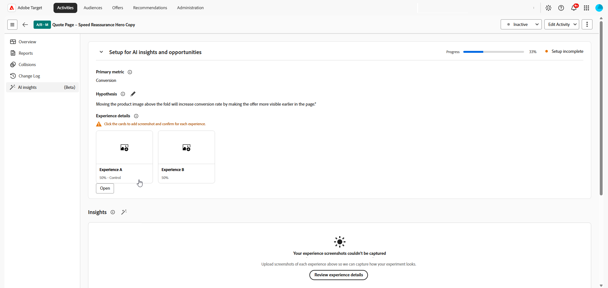
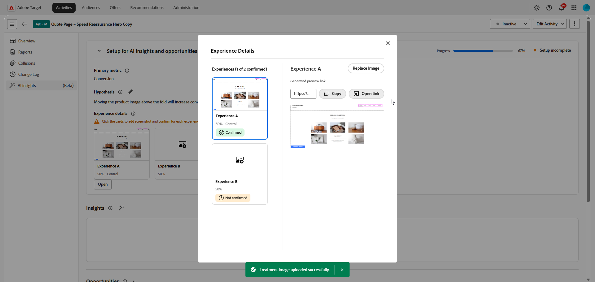
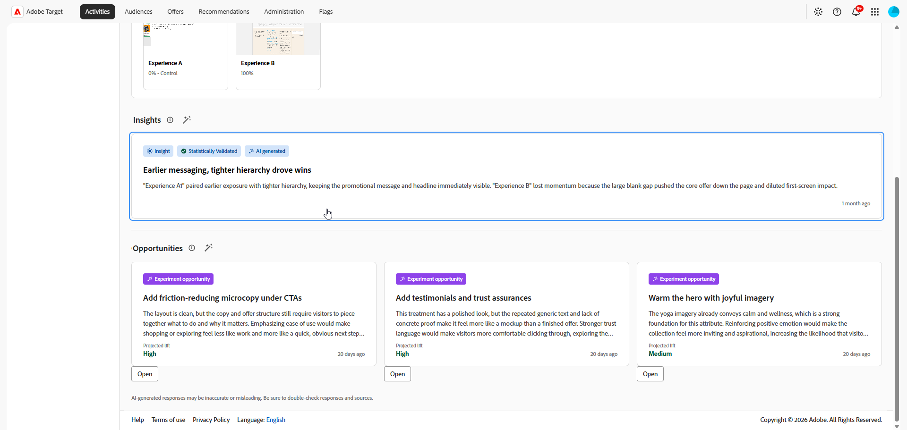
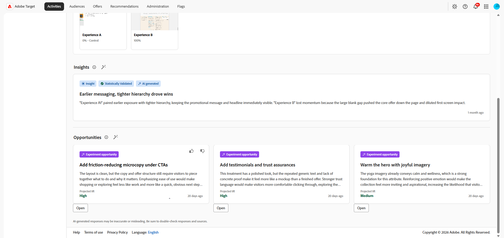

# AI insights

>[!AVAILABILITY]
>
>The AI insights feature is currently available as a beta feature.
> 
>The **[!UICONTROL AI insights]** section is available only for **[!UICONTROL A/B Test]** activities with **[!UICONTROL Manual]** traffic allocation.

The **[!UICONTROL AI insights]** menu in your **[!UICONTROL Activity Overview]** provides access to insights and optimization opportunities. Use this tab to review experiment learnings, compare treatments, and identify changes that might improve conversion rates.

## Setup for AI insights and opportunities

>[!CONTEXTUALHELP]
>id="target_ai_insights"
>title="Insights"
>abstract="Insights are AI-generated findings that become available when your experiment reaches statistical significance."

>[!CONTEXTUALHELP]
>id="target_ai_insights_primary_metric"
>title="Primary metric"
>abstract="The primary metric is automatically pulled from the reporting settings. To make changes, modify the goal metric under Goals & Settings."

>[!CONTEXTUALHELP]
>id="target_ai_insights_hypothesis"
>title="Hypothesis"
>abstract="The hypothesis is a statement you define that explains the expected outcome of the experiment. Include a description of what is being changed and where, then state which metric you expect to change and how."

>[!CONTEXTUALHELP]
>id="target_ai_insights_treatment_details"
>title="Experience details"
>abstract="Experience details show images of what a experience looks like when a user qualifies for it. You can review these images for all experiments. Some experiments may ask you to confirm the image or replace it if needed."

>[!CONTEXTUALHELP]
>id="target_ai_insights_primary_metric"
>title="Primary metric"
>abstract="The primary metric is automatically pulled from the reporting settings. To make changes, modify the goal metric under Goals & Settings."

>[!CONTEXTUALHELP]
>id="target_ai_insights_hypothesis"
>title="Hypothesis"
>abstract="The hypothesis is a statement you define that explains the expected outcome of the experiment. Include a description of what is being changed and where, then state which metric you expect to change and how."

>[!CONTEXTUALHELP]
>id="target_ai_insights_opportunities"
>title="Opportunities"
>abstract="Experiment opportunities are AI suggested treatment ideas based on patterns AI found in your experiment screenshots and results."

>[!CONTEXTUALHELP]
>id="target_ai_insights_treatment_details"
>title="Treatment details"
>abstract="Treatment details show images of what a treatment looks like when a user qualifies for it. You can review these images for all experiments. Some experiments may ask you to confirm the image or replace it if needed."

Before you can access AI-generated insights and opportunities, you first need to set up your activity by confirming the primary metric, hypothesis, and experience screenshots.

The primary metric is automatically pulled from the reporting settings and depends on how you set up your Goals & Settings. You must create the hypothesis in the AI insights panel. [Learn more](../c-activities/t-test-ab/t-test-create-ab/ab-goals-and-settings.md)

1. Open your activity in [!DNL Adobe Target].

1. Select the **[!UICONTROL AI insights]** menu to open the configuration panel.

1. Click  to create a hypothesis for your experiment.

    

1. Type in your hypothesis by describing the changes that were made and how they will impact the primary metric.

    Click **[!UICONTROL Save]**.

1. Under **[!UICONTROL Experience details]**, click a card to add a screenshot for your Experiences.

    >[!NOTE]
    >Some images may already be captured automatically. If so, confirm the screenshot by clicking **[!UICONTROL Confirm]**.

    

1. Select **[!UICONTROL Upload image]** to upload a preferred screenshot from your local files for each Experience.

    

1. Copy the preview link or open it directly to preview the experience.

1. Once each experience has a screenshot, review the details and click **[!UICONTROL Confirm]** to complete setup.

After setup is complete, your activity is ready to generate opportunities. Insights become available after the experiment has sufficient data for statistical validation and the required experiment details have been confirmed.

## Insights {#insights}

>[!CONTEXTUALHELP]
>id="target_ai_insights_insights"
>title="Insights"
>abstract="Experiment insights are AI-generated learnings that become available when the experiment reaches statistical significance."

Experiment insights are AI-generated learnings derived from this experiment. These insights become available once the experiment reaches statistical significance and provide context about what contributed to its success. They highlight the key attributes present in the winning Experience that are distinct from the control and likely influenced the outcome.

1. Click the card to access the **[!UICONTROL Insights]** menu.

    

1. Browse through your AI-generated insights to review the experiment learning and compare the winning Experience against the control.

    

1. In **[!UICONTROL What made this Experience win?]**, review the details explaining why this Experience outperformed the control.

## Opportunities

>[!CONTEXTUALHELP]
>id="target_ai_insights_opportunities"
>title="Opportunities"
>abstract="Experiment opportunities are AI suggested Experience ideas based on patterns AI found in your experiment screenshots and results."

The **[!UICONTROL Opportunities]** panel shows AI-generated recommendations designed to improve test performance and align with broader business objectives and KPIs.

1. Browse through the suggested opportunities and select the one you want to review.

    

1. Select an opportunity to open the Opportunity Details window, which outlines a specific Experience or variation. This view includes:

    * The current experience image used to generate the opportunity.

    * An AI-generated hypothesis that explains the expected outcome of the suggested Experience and why it may improve performance.

    * Guidance on how to implement the recommendation in your Experience and measure the effect on the selected metric.

    

