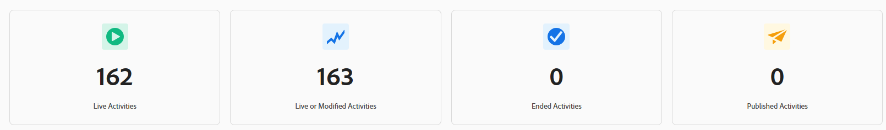

# Adobe Target Insights Dashboard

The [!UICONTROL Adobe Target Dashboard] gives a high-level view of how your organization uses [!DNL Adobe Target] over time. It helps teams understand adoption, activity volume, and experimentation usage at a glance.

The dashboard is designed for both practitioners and stakeholders who want quick visibility into [!DNL Target] usage without having to dig into individual activity reports.

When reviewing this dashboard, keep the following in mind:

* Metrics might include activities that started before or ended after the selected time range.
* An activity can be counted in multiple metrics depending on its lifecycle (for example, both published and completed).
* The dashboard focuses on usage and adoption, not performance outcomes.

For detailed results, lift, or statistical performance, refer to the [individual activity reports](../c-reports/reports.md) within [!DNL Adobe Target].

## [!UICONTROL Experimentation Accelerator]

The banner on your dashboard provides direct access to **[!UICONTROL Experimentation Accelerator]**, a lightweight entry point to tools that streamline experimentation workflows and simplify experiment setup, analysis, and decision-making.

## Time range selection

To scope the data shown on the dashboard, select a time range, for example, the last week, last year, or all time. The selected time range applies consistently across all metrics and charts on the dashboard.

Keep the following in mind when interpreting metrics across the selected time range:

* Some metrics reflect activities that were live at any point during the time range.

* Others reflect activities that were created, published, or completed within the time range.

* As a result, totals across metrics might not add up exactly. For example, many activities can be started and completed within the same time frame.

You can also export a snapshot of the dashboard by selecting **[!UICONTROL Download as PNG]** from the advanced menu.

## Metrics

The dashboard organizes its metrics into four complementary views, each answering a different question about your [!DNL Target] usage: [KPIs](#kpis) give an at-a-glance summary of activity counts, the [Activity type breakdown](#activity-type-breakdown) shows which capabilities you rely on most, [A/B testing metrics](#ab-testing-metrics) zoom in on experimentation usage, and [Activities Over Time](#activities-over-time) reveals trends across the selected time range.

### KPIs

The KPI cards at the top of the page summarize key activity counts for the selected time range at a glance. Each card focuses on a different stage of the activity lifecycle, live, modified, ended, or published, so you can quickly assess overall usage and momentum.

The **Total live activities** metric details the number of activities that were live at any point during the selected time range. An activity is considered live if it was actively serving traffic, even if it started before or ended after the selected period. Use this metric to:

* Understand how actively [!DNL Target] was used during the time period.
* Gauge the overall scale of your personalization and testing efforts.

The **Activities live or modified** metric represents the total number of activities in your organization that were live, created, or modified within the selected time frame. Use this metric to:

* Understand the overall size of your [!DNL Target] activity library and how many activities are in use.

* Track long-term growth of your experimentation and personalization programs.

The **Ended activities** metric represents the number of activities that reached a completion or stop date during the selected time range. Use this metric to:

* Understand how many activities concluded during the time period.
* Track completion volume over time.

The **Published activities** metric details the number of activities that were published during the selected time range. An activity is considered published when it is made live for the first time. If an activity is made live, stopped, and then made live again, only the first occurrence is counted in this metric. Use this metric to:

* Measure how many new activities were launched.
* Understand activity creation and publishing velocity.

### Activity type breakdown

The [!UICONTROL Activity Type] chart shows the distribution of live activities by type during the selected time range, including:

* [!UICONTROL A/B Test]
* [!UICONTROL Experience Targeting] 
* [!UICONTROL Recommendations] 
* [!UICONTROL Automated Personalization] 
* [!UICONTROL Multivariate Test]

Use this chart to identify which [!DNL Target] capabilities your organization relies on most, and to spot opportunities to broaden the mix of activity types you run.

### A/B testing metrics

{align="center"}

This section highlights usage specifically related to **[!UICONTROL A/B Test]** activities.

The **[!UICONTROL Total live A/B Test activities]** metric shows the number of **[!UICONTROL A/B Test]** activities that were live at any point during the selected time range.

The **[!UICONTROL Total A/B Tests published]** shows the number of **[!UICONTROL A/B Test]** activities that were published during the selected time range.

Use these metrics to understand how frequently A/B testing is being used and to track experimentation volume and adoption over time.

### Activities Over time

{align="center"}

The **[!UICONTROL Activities Over Time]** graph tracks the number of activities created, modified, and published across the selected time range, making it easy to spot trends, spikes, or quiet periods in your experimentation program.

