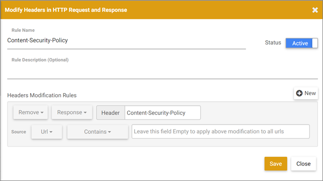

# Troubleshooting issues related to the [!DNL Adobe Target] [!UICONTROL Visual Experience Composer] and [!UICONTROL Enhanced Experience Composer]

Display problems and other issues sometimes occur in the [!DNL Target] [!UICONTROL Visual Experience Composer] (VEC) and the [!UICONTROL Enhanced Experience Composer] (EEC) under certain conditions.

## How do the Google Chrome SameSite cookie enforcement policies impact the VEC and EEC? {#samesite}

+++Details
Be aware of the changes that impact the VEC and EEC when using the following [!DNL Chrome] releases:

>[!NOTE]
>
>The following change affects all three updates outlined below: 
>
> * Will *not* be able to use the VEC without the [VEC Helper extension](/help/main/c-experiences/c-visual-experience-composer/r-troubleshoot-composer/visual-editing-helper-extension.md) installed and enabled for password-protected pages of your sites. Your site login cookies are considered 3rd-party cookies and are not sent with login requests inside the VEC editor in [!UICONTROL Browse] mode. The only exception is when your site login cookies already have the `SameSite=None` and `Secure` attributes set.

**Chrome 94 (September 21, 2021)**: With the impending changes planned for the Chrome 94 release (September 21, 2021), the following change impacts all users with Chrome 94+ browser versions:

* The command-line flag `--disable-features=SameSiteByDefaultCookies,CookiesWithoutSameSiteMustBeSecure` will be removed.

**Chrome 91 (May 25, 2021)**: With the changes implemented for the Chrome 91 release (May 25, 2021), the following change impacts all users with Chrome 91+ browser versions:

* The flags `#same-site-by-default-cookies` and `#cookies-without-same-site-must-be-secure` have been removed from `chrome://flags`. This behavior is now enabled by default.

**Chrome 80 (August 2020)**: With the changes implemented in August 2020, all users with Chrome 80+ browser versions:

* Will *not* be able to download [!DNL Target] libraries while editing an activity (when these aren't already on the site). This is because the download call is made from the customer domain towards a secured [!DNL Adobe] domain and is rejected as unauthenticated.

* The EEC will *not* function for all users because it is not able to set the SameSite attribute for cookies on `adobemc.com domain`. Without this attribute, the browser rejects these cookies, causing the EEC to fail.

+++

### Determine which cookies are blocked

+++Details
To determine which cookies are blocked because of the SameSite cookie enforcement policies, use the [!DNL Developer Tools] in [!DNL Chrome].

1. To access the [!DNL Developer Tools], while viewing the VEC in [!DNL Chrome], click the **[!UICONTROL ellipsis]** icon at the top-right corner of Chrome > **[!UICONTROL More Tools]** > **[!UICONTROL Developer Tools]**.
1. Click the **[!UICONTROL Network]** tab > then look for blocked cookies.

   >[!NOTE]
   >
   >Use the **[!UICONTROL Has blocked cookies]** checkbox to make finding blocked cookies easier. 

+++

## Does [!DNL Target] support multi-level iframes?

+++Details
[!DNL Target] does not support multi-level iframes. If your website loads an iframe that has a child iframe, at.js interacts with the parent iframe only. [!DNL Target] libraries do not interact with the child iframe.

As a workaround, you can add a page in the experience with the URL of the child iframe.

+++

## When I try to edit a page, all I see is a spinner instead of my page. (VEC and EEC) {#section_313001039F79446DB28C70D932AF5F58}

+++Details
This situation can happen if the URL contains a # character. To fix the issue, switch into [!UICONTROL Browse] mode in the VEC or EEC, and then switch back to [!UICONTROL Compose] mode. The spinner should go away and the page should load.

+++

## Content Security Policy (CSP) headers block the [!DNL Target] libraries on my website. (VEC and EEC) {#section_89A30C7A213D43BFA0822E66B482B803}

+++Details
If your website's CSP headers block [!DNL Target] libraries, then loads the website but prevents editing, ensure that the [!DNL Target] libraries are not blocked.

>[!NOTE]
>
>In addition to the following information, you can use the [Adobe Target VEC Helper browser extension](/help/main/c-experiences/c-visual-experience-composer/r-troubleshoot-composer/vec-helper-browser-extension.md) for [!DNL Google Chrome].

As a workaround, you can configure a [!DNL Requestly] rule to remove CSP headers, as shown below:

You can configure a similar [!DNL Requestly] rule for any header that causes a resource to not load inside the VEC.

For [!DNL Requestly], whenever there is a need to remove headers, you should do either of following:

* Add URL rules for the URL that you want to open in the VEC so that headers are removed for those URLs only. 
* Enable the rule when you are editing in the VEC and disable the rule when you are not using the VEC.

+++

## The VEC or EEC appears broken or does not initialize when re-editing a saved activity. (VEC and EEC) {#section_5AC3BA8F8FBB451EA814F298D0645E54}

+++Details
If the website has changed outside of the VEC after the experience was defined, selectors on which actions were taken earlier cannot be found when the activity is opened for re-editing. The page appears broken, and no warning displays.

+++

## The VEC or EEC does not show my rotating banners and other content containing JavaScript. (VEC and EEC) {#section_8B5BE6EB050B42D6A14A054724C41330}

+++Details
By default, the VEC blocks JavaScript elements. You can work with these elements if you disable JavaScript. Depending on how the site is set up, some items might continue to display incorrectly or to remain unavailable.

+++

## When I change one element on the page, multiple elements change. (VEC and EEC) {#section_309188ACF34942989BE473F63C5710AF}

+++Details
If the same DOM element ID is used on multiple elements on the page, changing one of those elements changes all elements with that ID. To prevent this from happening, an ID should be used only once on each page. This practice is a standard HTML best practice. For more information, see [Page Modification Scenarios](/help/main/c-experiences/c-visual-experience-composer/r-troubleshoot-composer/vec-scenarios.md#concept_A458A95F65B4401588016683FB1694DB).

+++

## I can't edit experiences for an iFrame-busting site. (VEC and EEC) {#section_9FE266B964314F2EB75604B4D7047200}

+++Details
This issue can be addressed by enabling the [!UICONTROL Enhanced Experience Composer] (EEC). Click **[!UICONTROL Administation]** > **[!UICONTROL Visual Experience Composer]**, then select the check box that enables the [!UICONTROL Enhanced Experience Composer]. The EEC uses an [!DNL Adobe]-managed proxy to load your page for editing. This proxy allows editing on iFrame-busting sites and allows editing on sites and pages where you have not yet added [!DNL Adobe Target] code. The activities do not deliver to the site until the code has been added. Some sites might not load via the EEC, in which case you can uncheck this option to load the EEC via an iFrame.

>[!NOTE]
>
>Your locally hosted pages or pages that are not accessible outside your network are not accessible to the [!DNL Adobe] proxy server and cannot be opened in the EEC. These pages might include staging URLs, User Acceptance Testing (UAT) URLs, or locally hosted pages.

+++

## I want to set up tests on pages that don't have the mbox/[!DNL Target] implementation done yet. (VEC and EEC) {#section_DE63BCCB5B124E10A71FA579B582A80A}

+++Details
See "I can't edit experiences for an iFrame-bursting site" above.

+++

## Bold and italic text styles with [!UICONTROL Edit Text]/[!UICONTROL Edit HTML] or [!UICONTROL Change Text]/[!DNL Change HTML] do not show on my page. Sometimes the text disappears after applying these style changes. (VEC and EEC) {#section_7A71D6DF41084C58B34C18701E8774E5}

+++Details
If you use **[!UICONTROL Edit Text]/[!UICONTROL Edit HTML]** in the VEC for [!UICONTROL A/B Test] or [!UICONTROL Experience Targeting] activities or **[!UICONTROL Change Text]/[!UICONTROL Change HTML]** for [!UICONTROL Automated Personalization] or [!UICONTROL Multivariate Test] activities to make text bold or italic, those styles might not be applied on the page or the text disappears from the page in the VEC. This happens because of the way the rich-text editor applies these styles might interfere with the website markup.

If you see this issue:

1. Click the **[!UICONTROL HTML]** button in the rich-text editor to enter source editing mode. 
1. Find the styles text elements.

    * For bold text, change `<strong>` elements to `<b>`. 
    
    * For italic text, change `<em>` elements to `<i>`.

+++

## For Automated Personalization activities, image swapping appears broken in the VEC or EEC. (VEC and EEC) {#section_88AABFDFE6A3420299B0D508B12A3994}

+++Details
Adding an image offer to a location takes the full dimension of the original image space in the VEC or EEC. On delivery, the image is not expanded and is shown as it is, so there is no impact on delivery.

+++
