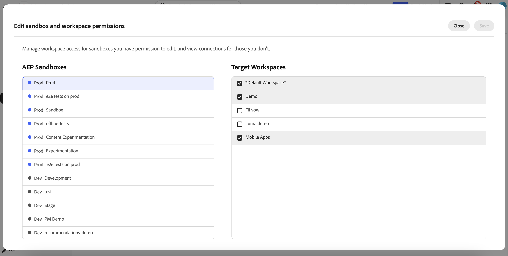

# Integrate [!DNL Target] with Experimentation Accelerator

Experimentation Accelerator helps administrators manage how [!DNL Adobe Target] workspace activities are organized and displayed in the application. By mapping each [!DNL Target] workspace to the appropriate Experimentation Accelerator sandbox, teams can view experiments from [!DNL Adobe Target] and [!DNL Adobe Journey Optimizer] in one place.

➡️ [Learn more about Adobe Experimentation Accelerator](https://experienceleague.adobe.com/en/docs/experimentation-accelerator/using/overview)

## Before you begin

Before you set up sandbox assignments, confirm that you have the required permissions. To access **[!UICONTROL Administration]** in Experimentation Accelerator, you must have the **[!UICONTROL Manage configuration]** permission.

Users can assign [!DNL Target] workspaces to sandboxes only when both conditions are met:

* The user has the **[!UICONTROL Manage configuration]** permission in Experimentation Accelerator.
* The user is a [!DNL Target] product administrator.

## Set up sandbox assignment for [!DNL Target] workspaces

Before you assign workspaces, note that [!DNL Target] workspace can be assigned to only one sandbox to prevent duplicate entries for the same test.

To choose which sandbox each [!DNL Target] workspace appears in:

1. In Experimentation Accelerator, open **[!UICONTROL Administration]**.

    

1. Review the table of current [!DNL Target] workspace-to-sandbox assignments.

    

1. Click **[!UICONTROL Edit]**.

    

1. For each sandbox, assign the appropriate [!DNL Target] workspaces.

    

1. Click **[!UICONTROL Save]** to apply your changes.

After the initial connection is created for a [!DNL Target] workspace, allow up to 30 minutes for updates to propagate across the system.
