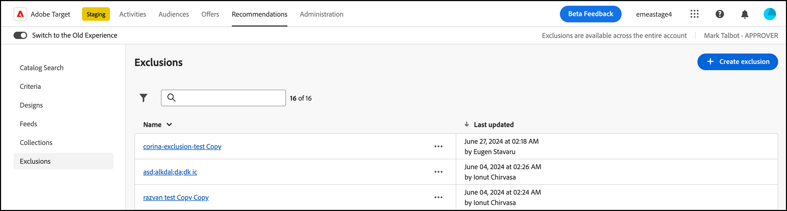

# Exclusions

Create an exclusion in [!DNL Adobe Target Recommendations] to prevent products or content from being recommended to visitors. An exclusion is a subset of products or content that should not be recommended to visitors.

Exclusions are available across the entire account. Unlike collections, where you specify a specific collection for each experience as you create a [!UICONTROL Recommendations] activity, exclusions apply to all activities across the account. There is no option to assign an exclusion group during activity creation.

Some examples of times you would use exclusions include:

* Products that have been discontinued.
* The Fall and Winter catalog is now the only catalog that should be present online. Any item from the Summer catalog is no longer available for purchase.
* Items that might be inappropriate to recommend on most pages or screens (adult products, NC-17 movies, and so forth).
* Products with incomplete metadata fields (missing thumbnail, price, or other important metadata).
* Products that should never be recommended (maybe a SKU exists in the system for something but it isn't a purchasable item. Or maybe it is a fake SKU for the QA team to simulate a purchase without actually ordering something, and so forth).

>[!IMPORTANT]
>
>Exclusion rules are applied globally to all [environments](/help/main/administrating-target/environments.md).
>
>Static and dynamic exclusion rules are powerful features that can help you with your marketing efforts. For detailed information, examples, and use-case scenarios, see [Use Dynamic and Static Inclusion Rules](/help/main/c-recommendations/c-algorithms/use-dynamic-and-static-inclusion-rules.md#concept_4CB5C0FA705D4E449BD0B37B3D987F9F).

## Create an exclusion

1. Click **[!UICONTROL Recommendations]** > **[!UICONTROL Exclusions]** to display the list of existing exclusions.

   

   The "Number of Items" reported for each exclusion on the [!UICONTROL Exclusions] list view is the number of products matching the rules for that exclusion within the configured default Recommendations [host group](/help/main/administrating-target/hosts.md) (environment). See [Plan and implement [!DNL Recommendations]](https://experienceleague.adobe.com/en/docs/target-dev/developer/recommendations){target=_blank} in the *Adobe Target Developer Guide* for information about how to change the default host group.

1. (Conditional) Click the [!UICONTROL Filter] icon, then choose the desired [environment](/help/main/administrating-target/environments.md) from the **[!UICONTROL Environment]** drop-down list while creating (or updating) an exclusion to preview the contents of the exclusion in that environment. By default, results from the default host group are displayed.

   

1. Click **[!UICONTROL Create Exclusion]**.

   

1. Type an exclusion **[!UICONTROL Name]** and enter an optional description.

1. Use the rule builder to create your exclusions.

   Select a parameter in the Rules list, select an operator, and then enter one or more values to identify the products. Separate multiple values with commas.

1. Click **[!UICONTROL Create]**.

<!-- ## Create an exclusion using Advanced Search

You can also create exclusions using [!UICONTROL Advanced Search] on the [Catalog Search](/help/main/c-recommendations/c-products/catalog-search.md#save-as) page ( [!UICONTROL Recommendations] > [!UICONTROL Catalog Search] > [!UICONTROL Advanced Search]). 

After creating a search using "id > contains," for example, you can then click [!UICONTROL Save As] > [!UICONTROL Exclusion].

>[!IMPORTANT]
>
>The [!UICONTROL Advanced Search] functionality is case-insensitive; however, products returned at the time of delivery are based on case-sensitive search. This mismatch might lead to confusion. Ensure that you consider case-sensitivity when you create exclusions based on results using the Advanced Search functionality. For example, if you perform a search for "Holiday," that initial search lists results containing "Holiday" and "holiday." If you then create an exclusion with the intent to exclude products containing "holiday," only products containing "holiday" are excluded. Products containing "Holiday" are not excluded. -->

## Edit, copy, or delete an exclusion

Click the **ellipsis** icon next to the desired exclusion in the list, then click the appropriate icon: edit, copy, or delete.

 

You can copy an existing exclusion to create a duplicate exclusion that you can then modify. This option lets you create a similar exclusion with less effort.

Be aware that exclusions are available across the entire account. Ensure that you consider this caveat before deleting an exclusion. Deleted exclusions cannot be recovered.

## Training video: Create collections and exclusions in Recommendations (7:05) 

This video contains the following information:

* Create a collection
* Create an exclusion

>[!VIDEO](https://video.tv.adobe.com/v/27689)
