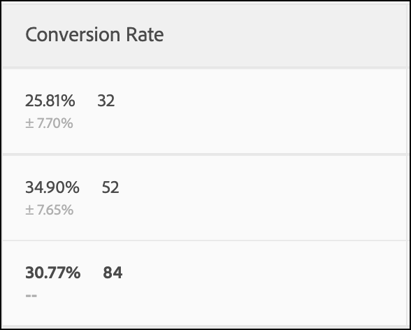
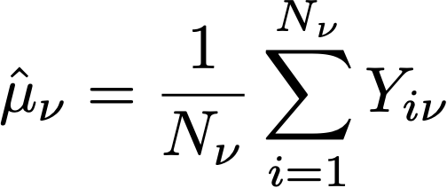
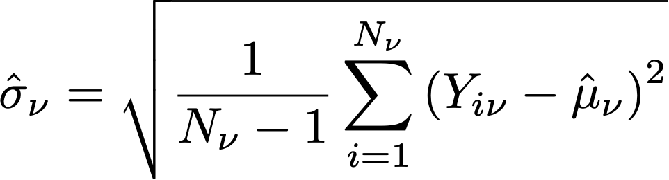
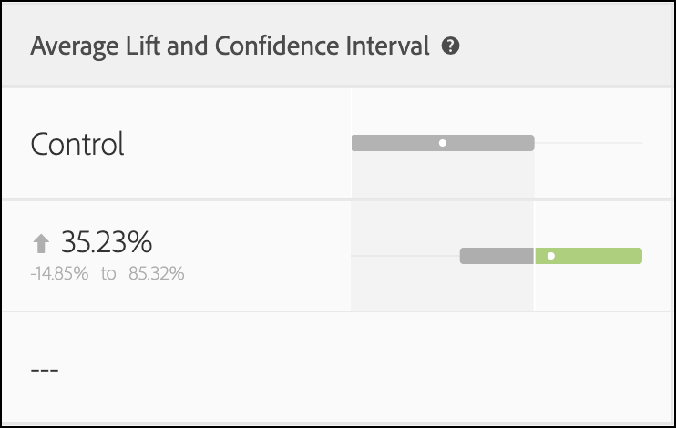
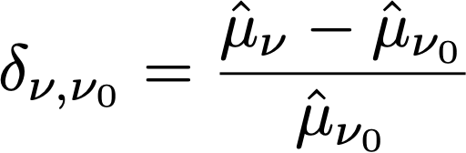
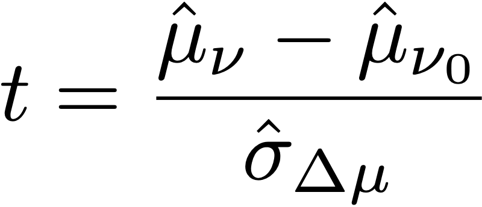
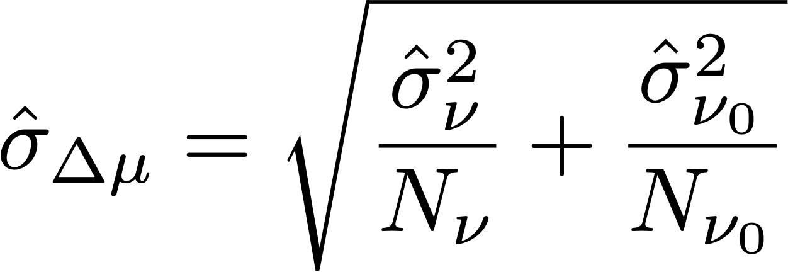

# Statistical calculations in A/Bn tests

This article documents the detailed statistical calculations used in manual A/Bn tests in [!DNL Adobe Target]. Definitions are provided for **[!UICONTROL Conversion Rate]**, **[!UICONTROL Confidence Interval of Conversion Rate]**, **[!UICONTROL Lift]**, **[!UICONTROL Confidence Interval for Lift]**, **[!UICONTROL Confidence]**, and **[!UICONTROL Bayesian]** decision metrics.

An **[!UICONTROL A/B Test]** (Manual) activity supports two statistical methodologies, selected per activity in [Goals & Settings](/help/main/c-activities/t-test-ab/t-test-create-ab/ab-goals-and-settings.md#section_13119392051044FBA6387D9B3B1C43CF):

* [Welch's t-test](#welchs-t-test): a frequentist methodology that reports a **[!UICONTROL Confidence]** percentage and confidence interval, based on a fixed-sample-size hypothesis test. Used for activities with a **[!UICONTROL Revenue]** or **[!UICONTROL Engagement]** primary goal.

* [Bayesian](#bayesian-statistics): reports results as probabilities, such as **[!UICONTROL Chance to Beat Control]** and credible intervals, computed from the full posterior distribution of each experience's goal metric. This setting is only available for activities whose primary goal metric is **[!UICONTROL Conversion]**.

## Welch's t-test

### Mean performance

The following section explains the calculations used in the following illustration.

![Target report showing the [!UICONTROL Conversion Rate], [!UICONTROL Average Lift and Confidence Interval], and [!UICONTROL Confidence] of an A/B Test activity.](/help/main/c-reports/statistical-methodology/img/target_report.png)

#### Conversion Rate and Revenue Per Visitor (RPV) Campaigns

The following illustration shows **[!UICONTROL Conversion Rate]**, **[!UICONTROL Confidence Interval of Conversion Rate]**, and the number of **[!UICONTROL Conversions]** in a [!DNL Target] report. For example, the first line shows that for Experience A: the **[!UICONTROL Conversion Rate]** is 25.81% with a **[!UICONTROL Confidence Interval]** of ±7.7% and 32 conversions were recorded. Given that 124 Visitors saw the experience, this equates to 32/124 = 25.81%.

<p style="text-align:center;"></p>

The conversion rate or **mean**, *μ<sub>ν</sub>*, for each experience *ν* in an experiment is defined as a ratio of the sum of the metric to the number of units assigned to that metric, *N<sub>ν</sub>*:

<p style="text-align:center;"></p>

Here, 

* *Y<sub>iν</sub>* is the value of the metric for each unit *i*, that has been assigned to a given experience *ν*.

* The sum over units *i* depends on the choice of counting methodology.

    * If **[!UICONTROL Visitors]** is used as the counting methodology, each unit is a unique visitor defined as a unique participant in the activity for the life of the activity.
    * If **[!UICONTROL Visits]** is used as the counting methodology, each unit is a unique visit defined as a unique participant in an experience during a [!DNL Target] session (with a unique `sessionId`). When the `sessionId` changes, or the visitor reaches the conversion step, a new visit is counted.
    * If **[!UICONTROL Activity Impressions]** is used as the counting methodology, each unit is a unique impression defined as each time a visitor loads any page of the activity.

### [!UICONTROL Confidence Interval of Mean]/[!UICONTROL Conversion Rate]

The confidence interval of the conversion rate is intuitively defined as range of possible conversion rates that is consistent with the underlying data. 

When running experiments, the conversion rate for a given experience is an *estimate* of the "true" conversion rate. To quantify the uncertainty in this estimate, [!DNL Target] uses a confidence interval. [!DNL Target] always reports a 95% confidence interval, which means that in the end, 95% of confidence intervals calculated include the true conversion rate of the experience.

A "Confidence" number is also reported next to the currently leading or winning experience. This figure is reported only until the leading experience's **[!UICONTROL Confidence]** reaches at least 60%. If two experiences are present in the activity, this number represents the confidence level that the experience is performing better than the other experience. If more than two experiences are present in the activity, this number represents the confidence level that the experience is performing better than the defined "Control" experience. If the "Control" experience is winning, no "Confidence" figure is reported.

A 95% confidence interval of conversion rate *μ<sub>ν</sub>* is defined as the range of values: 

<p style="text-align:center;"></p>

Where the standard error for the mean is defined as

<p style="text-align:center;"></p>

Where an unbiased estimate of the sample standard deviation is used:

<p style="text-align:center;"></p>

When the campaign is a conversion rate campaign (i.e., the conversion metric is binary), the standard error reduces to:

<p style="text-align:center;"></p>

### Lift

The following illustration shows **[!UICONTROL Lift]** and **[!UICONTROL Confidence Interval of Lift]** in a [!DNL Target] Report. The number represents the average of the range of the lift bounds, and the arrow reflects if the lift is positive or negative. The arrow displays in grey until the confidence passes 95%. After confidence passes the threshold, the arrow is green or red based on a positive or negative lift. 

<p style="text-align:center;"></p>

The lift between an experience  *ν*, and the control experience *ν<sub>0</sub>* is the relative "delta" in conversion rates, defined as 

<p style="text-align:center;"></p>

Where the individual conversion rates are as defined above. More simply, 

```
Lift(Experience N) = (Performance_Experience_N - Performance_Control)/ Performance_Control
```

If the conversion rate of the control experience *ν<sub>0</sub>* is 0, there is no lift. 

### [!DNL Confidence Interval of Lift]

The boxplot graph in the **[!UICONTROL Average Lift and Confidence Interval]** column represents the average value and 95% **[!UICONTROL Confidence Interval of Lift]**. The boxplot is grey when there is any overlap in the confidence interval of a given non-control experience with the confidence interval of control experience. The boxplot is green or red when the range of given experience's confidence interval is above or below the confidence interval of control experience.

The standard error of the lift between an experience  *ν*, and the control experience  *ν<sub>0</sub>* is defined as:

<p style="text-align:center;"></p>

Then the 95% Confidence Interval of the lift is:

<p style="text-align:center;"></p>

This calculation uses the "Delta" method, and is described [in more detail in this document](/help/main/assets/confidence_interval_lift.pdf)

### [!UICONTROL Confidence]

The last column shows the confidence in a [!DNL Target] report. The confidence of an experience is a probability (denoted as a percentage) of obtaining a result as extreme as the one that is observed, given the null hypothesis is true. In terms of p-values, the confidence displayed is *1 - p-value*. Intuitively, higher confidence means that it is less likely that the control and non-control experience have equal conversion rates. 

In [!DNL Target], a two-tailed **Welch's t-test** is performed between the test experience and the control experience to test if the means of test and control experiences are the same. Because we usually do not know if sample sizes and variances of two groups are the same before running the experiment, and [!DNL Target] also allows you to have unequal percentages of traffic sent to each experience, we do not assume that the variance for each experience is equal. Thus, Welch's t-test is chosen instead of Student's t-test. 

To perform Welch's t-test, we first start calculating the t-statistic and the degrees of freedom, then run a two-tailed t-test to generate the p-value. Finally, we calculate the confidence based on p-value. 

The *t*-statistic is defined to be the difference of the means of any two independent random variables, *ν* and *ν<sub>0</sub>*, divided by the standard error of the difference:

<p style="text-align:center;"></p>

Where *μ<sub>v</sub>* and *μ<sub>v0</sub>* are the means of *ν*  and *ν<sub>0</sub>* respectively, and the standard error of the difference between *μ<sub>v</sub>* and *μ<sub>v0</sub>* are given by:

<p style="text-align:center;"></p>

Where *σ<sup>2</sup><sub>v</sub>* and *σ<sup>2</sup><sub>v<sub>0</sub></sub>* are the variances of two experiences *ν*  and *ν<sub>0</sub>* respectively, and *N<sub>v</sub>* and *N<sub>v<sub>0</sub></sub>* are sample sizes for *ν* and *ν<sub>0</sub>* respectively. 

For Welch's t-test, the degree of freedom is calculated as following:

<p style="text-align:center;"></p>

And degree of freedom for *ν*  and *ν<sub>0</sub>* are defined as:

<p style="text-align:center;"></p>

<p style="text-align:center;"></p>

Then the p-value can be computed from the area in the tails of the *t*-distribution:

<p style="text-align:center;"></p>

Finally, the confidence reported in [!DNL Target] is defined as:

<p style="text-align:center;"></p>

## Bayesian statistics

Instead of computing a p-value from an approximated distribution, a **[!UICONTROL Bayesian]** activity's report expresses results as probabilities, computed from the full posterior distribution of each experience's goal metric. This makes it safe to monitor a **[!UICONTROL Bayesian]** report continuously, since there is no statistical penalty for checking results before a fixed sample size is reached, and it can converge faster on smaller samples than **[!UICONTROL Welch's t-test]**.

The **[!UICONTROL Bayesian]** methodology also lets marketers feed in a hypothesis based on their past experimentation and results for the control variant.

The **[!UICONTROL Bayesian]** methodology is only available for activities whose primary goal metric is **[!UICONTROL Conversion]**, activities with a **[!UICONTROL Revenue]** or **[!UICONTROL Engagement]** primary goal always use **[!UICONTROL Welch's t-test]**. For more information about selecting a methodology, see [Goals and settings](/help/main/c-activities/t-test-ab/t-test-create-ab/ab-goals-and-settings.md#section_13119392051044FBA6387D9B3B1C43CF).

### Average Lift and Credible interval

<p style="text-align:center;"></p>

Average lift and the credible interval together measure performance improvement and its uncertainty in a **[!UICONTROL Bayesian]** activity. Average lift is the mean percentage change between a treatment and the control, while the credible interval defines the range within which the true lift falls at a specified probability.

### [!UICONTROL Chance to Beat Control]

<p style="text-align:center;"></p>

**[!UICONTROL Chance to Beat Control]** is the probability that an experience's goal metric outperforms the **[!UICONTROL Control]** experience, for example, "92% chance B beats A". This is the primary decision metric for a **[!UICONTROL Bayesian]** activity: a challenger experience is a candidate to replace **[!UICONTROL Control]** when its **[!UICONTROL Chance to Beat Control]** meets the activity's decision threshold.

<!--
### [!UICONTROL Probability to be Best]

[!UICONTROL Probability to be Best] is the probability that an experience is the single best of all experiences in the activity. Use this decision metric to pick which winner to ship in a test with more than one challenger experience.
-->

## Performing Calculations offline

The [downloaded CSV report](/help/main/c-reports/c-report-settings/downloading-data-in-csv-file.md) includes only raw data and does not include calculated metrics, such as revenue per visitor, lift, or confidence used for A/B tests.

To compute these statistical quantities, download the [!DNL Target] [Complete Confidence Calculator](/help/main/assets/complete_confidence_calculator.xlsx) Excel file to input the activity's value.
