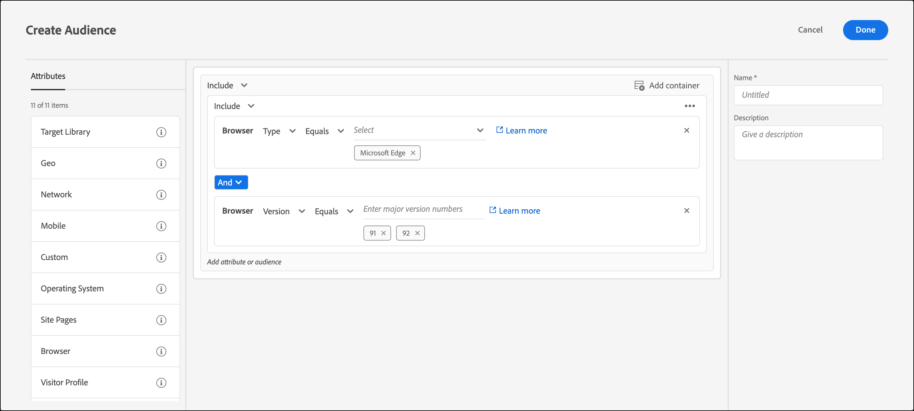

# Browser

You can target users who use a specific browser or specific browser options when they visit your page.

The following browsers can be targeted:

* Chrome
* Firefox
* Safari
* Internet Explorer
* Microsoft Edge
* Opera
* iPad
* iPhone

>[!IMPORTANT]
>
>Starting April 30, 2024, iPad and iPhone will be removed from the available [!UICONTROL Browser] type drop-down list when creating categories for audiences. For workaround settings, see [Deprecation of iPad and iPhone from Browser audience attribute (April 30, 2024)](#deprecation) below.

There are two ways to target browsers:

* **Pre-built Audience:** Use the pre-built audience if you want to target only visitors who use a specific browser to visit your site. For example, if you are offering a Chrome extension, you would target only Chrome users.

  1. When setting up your activity, select the browser from the drop-down list.

     This option targets the activity only to visitors who use the specified browser.

     

* **Customized Browser Audience Rule:** A customized audience lets you target multiple browsers, or to set up rules or exclusions for specific browsers, browser versions, or browser languages. This functionality provides significant flexibility when targeting an activity based on browser attributes.

  1. In the [!DNL Target] interface, click **[!UICONTROL Audiences]** > **[!UICONTROL Create Audience]**. 
  1. Name the audience and add an optional description. 
  1. Drag and drop **[!UICONTROL Browser]** into the Audience Builder.

     

  1. Click **[!UICONTROL Select]**, then select one of the following options:

     * **Type:** Target or exclude a certain browser. See [Type](/help/main/c-target/c-audiences/c-target-rules/browser.md#section_6ADC758F23F145B3A310151546D83D56). 
     * **Language:** Target or exclude certain browsers that are set to use specific languages. See [Language](/help/main/c-target/c-audiences/c-target-rules/browser.md#section_7520D1AA464A45A6843EABE2D2B431A1). 
     * **Version:** Target or exclude certain browser versions. See [Version](/help/main/c-target/c-audiences/c-target-rules/browser.md#section_37CC8CE45DA04E8682AE6388321BA6EF).

  1. (Optional) Set up additional rules for the audience. 
  1. Click **[!UICONTROL Done]**.

  The following example shows an audience that includes Microsoft Edge users on versions 91 or 92:

  

## Browser Options {#concept_221D8EEF53CC45AEACEB17CF336A3658}

Target or exclude activity entrants based on their browser type, language, or version.

### Type {#section_6ADC758F23F145B3A310151546D83D56}

Target or exclude a certain browser.

Select **[!UICONTROL Type]**, then choose either equals or does not equal.

* Equals: Target the selected browsers. 
* Does not equal: Exclude the selected browsers.

Select one or more browsers. Multiple options are connected with an OR.

### Language {#section_7520D1AA464A45A6843EABE2D2B431A1}

Target or exclude certain browsers that are set to use specific languages.

For example, if an offer is available only in English, you might target browsers with their language set to English. Or, if your page is not double-byte enabled, you might exclude browsers set to East Asian languages.

Including or excluding browser language can provide more accurate visitor targeting than targeting based on geography in cases where language is more important than location. For example, if you are offering an article written in English, you could either target English-speaking countries, or you could target browsers that are set to English. Targeting to the browser makes the article available to English speakers in countries where English is not the primary language.

Select **[!UICONTROL Language]**, then choose either equals or does not equal.

* Equals: Target the selected browser languages. 
* Does not equal: Exclude the selected browser languages.

Select one or more languages. Multiple options are connected with an OR.

The following browser languages can be targeted or excluded:

* English 
* French 
* German 
* Japanese 
* Korean 
* Portuguese 
* Russian 
* Spanish 
* Traditional Chinese

### Version {#section_37CC8CE45DA04E8682AE6388321BA6EF}

Target or exclude certain browser versions.

For example, if your page does not appear correctly in Internet Explorer version 11 or earlier, you can create an audience that excludes those versions. In that case, you would set up a rule where the browser type equals Internet Explorer and add a second rule where the version is less than or equal to 11.

Select **[!UICONTROL Version]**, then choose an operator:

* Equals 
* Does not equal 
* Is greater than 
* Is greater than or equal to 
* Is less than 
* Is less than or equal to

Type the version number. Only major versions can be entered in the text field. The specified version includes any minor version of that release. For example, if you specify version 10, visitors on version 10.1 are also included.

Multiple options are connected with an OR. 

## Training video: Creating Audiences 

This video includes information about using audience categories.

* Create audiences 
* Define audience categories

>[!VIDEO](https://video.tv.adobe.com/v/17392)

## Deprecation of iPad and iPhone from Browser audience attribute (April 30, 2024) {#deprecation}

[!DNL Adobe Target] lets you [target on any of several category attributes](/help/main/c-target/c-audiences/c-target-rules/target-rules.md), including users who use a specific browser or browser options when they visit your page.

Starting April 30, 2024, iPad and iPhone will be removed from the available [!UICONTROL Browser] type drop-down list when creating categories for audiences.

If you have audiences that target iPads or iPhones using the [!UICONTROL Browser] attribute, you must change these settings before April 30, 2024 to ensure that these audiences continue to function as expected.

The following settings could be used going forward:

* [!UICONTROL Mobile] > [!UICONTROL Device Vendor] [!UICONTROL matches] [!DNL Apple]

  

* [!UICONTROL Mobile] > [!UICONTROL is Tablet]

  

* [!UICONTROL Mobile] > [!UICONTROL Device Marketing Name] [!UICONTROL matches] [!DNL iPad]

  

* [!UICONTROL Mobile] > [!UICONTROL Device Marketing Name] [!UICONTROL matches] [!DNL iPhone]

  

There are many other possible settings that could be used, for example when conditions are negated. Examples of negated conditions could look like the following:

* [!UICONTROL Mobile] > [!UICONTROL Device Vendor] [!UICONTROL does not match] [!UICONTROL Apple] with an Or container with [!UICONTROL Mobile] > [!UICONTROL Is Mobile Phone] is [!UICONTROL false]

  

* [!UICONTROL Mobile] > [!UICONTROL Device Vendor] [!UICONTROL does not match] [!UICONTROL Apple] with an Or container with [!UICONTROL Mobile] > [!UICONTROL Is Tablet] is [!UICONTROL false].

  

If you use `user.browserType` in JavaScript segments, changes could include the following:

* BrowserType is iPhone

  Replace:

  `user.browserType=="iphone"`

  With:

  `user.mobile.deviceVendor == "Apple" && user.mobile.deviceModel && user.mobile.deviceModel.toLowerCase().includes("iphone")`

* BrowserType is not iPhone
  
  Replace:

  `user.browserType!="iphone"`
  
  With:

  `user.mobile.deviceVendor != "Apple" || user.mobile.deviceModel == null !! !user.mobile.deviceModel.toLowerCase().includes("iphone")`

* BrowserType is iPad
  
  Replace:

  `user.browserType=="ipad"`

  With:

  `user.mobile.deviceVendor == "Apple" && user.mobile.deviceModel && user.mobile.deviceModel.toLowerCase().includes("ipad")`

* BrowserType is not iPad
  
  Replace:

  `user.browserType!="ipad"`

  With:

  `user.mobile.deviceVendor != "Apple" || user.mobile.deviceModel == null !! !user.mobile.deviceModel.toLowerCase().includes("ipad")`