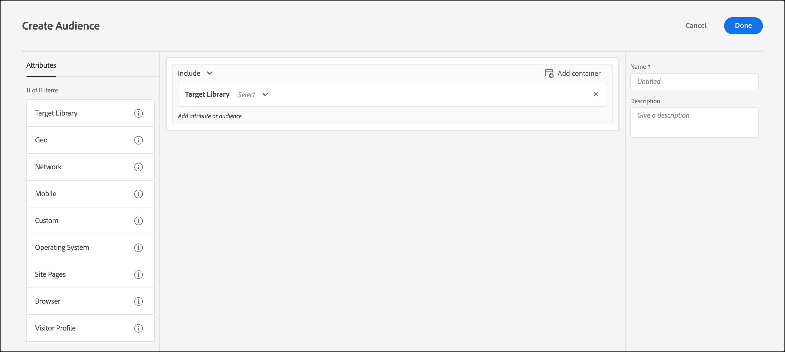

# Target Library

Use [!DNL Adobe Target] to target users based on pre-built targeting rules.

The pre-built audiences in the [!UICONTROL Target Library] category are legacy audiences and exist in other categories. For more information and best practices, see [Targets and audiences frequently asked questions](/help/main/c-target/c-troubleshooting-targets-and-audiences/troubleshooting-targets-and-audiences.md#concept_C4EE4B8F4840430CBD798D579A8F208D).

1. In the [!DNL Target] interface, click **[!UICONTROL Audiences]** > **[!UICONTROL Create Audience]**. 
1. Name the audience and add an optional description. 
1. Drag and drop **[!UICONTROL Target Library]** into the audience builder pane.

   

1. Click **[!UICONTROL Select]**, then select a pre-built targeting rule.

   Pre-built targeting rules include, [!UICONTROL Windows Operating System], [!UICONTROL Tablet Device], [!UICONTROL Safari Browser], [!UICONTROL Returning Visitors], [!UICONTROL Referred from Google], and more.

   The predefined audience "[!UICONTROL Tablet Device]" already qualifies when the user agent contains one of the following strings (some of which are model numbers of devices). You do not have to create custom targeting rules for these devices.

   Kindle, Silk, iPad, Sony Tablet, TF101, GT-P1000, GT-P1000R, GT-P1000M, SGH-T849, SHW-M180S, GT-I9000T, BNTV250, and Tablet PC. 

1. (Optional) Set up additional rules for the audience. 
1. Click **[!UICONTROL Done]**.

## Training video: Creating Audiences

This video includes information about using audience categories.

* Create audiences 
* Define audience categories

>[!VIDEO](https://video.tv.adobe.com/v/17392)
